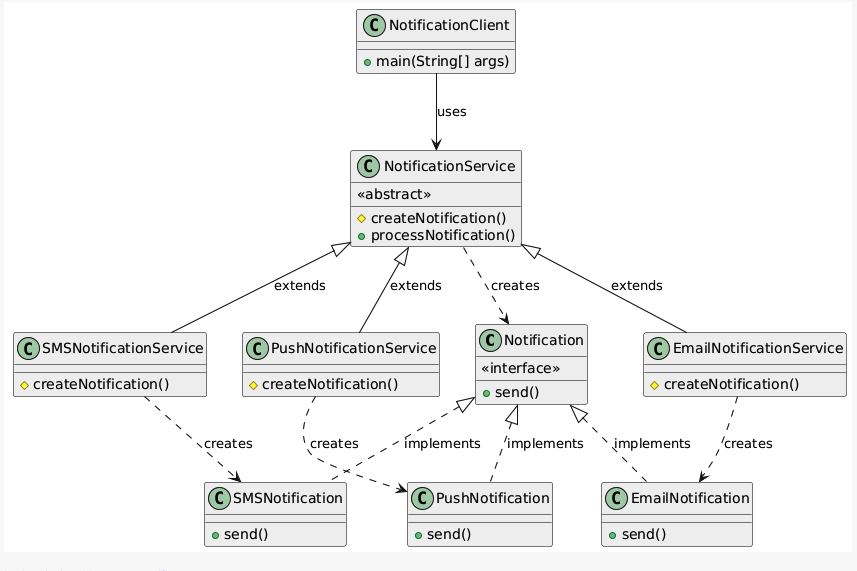
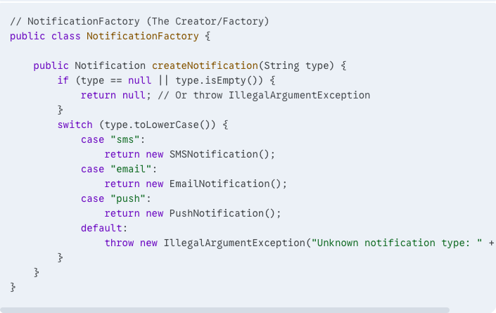

# 🏭 Factory Method Design Pattern

## 📌 Intent

The **Factory Method** is a **creational design pattern** that defines an interface for creating objects in a superclass, while allowing subclasses to alter the type of objects that will be created.

---

## ❓ Problem It Solves

Imagine you're building an application where the type of object to be created isn't known until runtime or depends on certain conditions.

### 🔧 Without a Factory

Your client code might look like this:

This leads to several issues:

- ❌ **Tight Coupling**  
  The client code is directly tied to specific implementations like `SMSNotification`, `EmailNotification`, etc.

- ❌ **Violation of Open/Closed Principle**  
  Adding a new type of notification requires modifying the client code.

- ❌ **Scattered Creation Logic**  
  Object creation logic is repeated and scattered across the codebase.

✅ The **Factory Pattern** resolves these issues by **centralizing** object creation and **decoupling** clients from specific classes.

---

## 🖼️ Class Diagram

---

## 🧩 Core Components

### 🔹 Product (Interface or Abstract Class)
Defines the contract for the objects the factory method creates.  
**Example**: `Notification` interface

### 🔹 Concrete Products
Implement the `Product` interface.  
**Example**: `SMSNotification`, `EmailNotification`, `PushNotification`

### 🔹 Creator (Abstract Class or Interface)
Declares the factory method that returns a `Product` object.  
May also include logic that uses the `Product` objects.  
**Example**: `NotificationFactory`

### 🔹 Concrete Creators
Override the factory method to return specific product instances.  
**Example**: `SMSNotificationFactory`, `EmailNotificationFactory`

---

## ⚙️ How It Works

1. The **client** works with the `Creator` and `Product` interfaces.
2. The client instantiates a specific **Concrete Creator** (e.g., `EmailNotificationFactory`).
3. The factory method inside the Concrete Creator returns a `Concrete Product`.
4. The rest of the code uses the `Product` interface—no dependency on concrete implementations.

---

## ✅ Advantages

- 🔄 **Loose Coupling**  
  Clients are not dependent on concrete product classes.

- 🧹 **Single Responsibility**  
  Creation logic is separated from business logic.

- 🚪 **Open/Closed Principle**  
  New product types can be added without changing client code.

- 🧰 **Encapsulation of Complexity**  
  Complex object creation logic is hidden inside factories.

---

## 🕒 When to Use

- You don’t know in advance what class instances are needed.
- You want to delegate instantiation to subclasses.
- Object creation involves **complex or multi-step logic**.
- You want to **centralize and manage object creation**.

---

## ⚠️ Disadvantages

- 📈 **More Classes**  
  May introduce extra abstraction for simple use cases.

---

> 💡 **Tip**: Use Factory Method when flexibility and scalability are more important than minimal structure.

---

## 🧪 Simplified Version: Factory Pattern

A simplified form of Factory Method is commonly known as the **Factory Pattern**, which uses a **single factory class** to create instances.

### 🖼️ Diagram

In this approach:
- All object creation is handled by one class.
- Easier for simple use cases but less flexible for future scaling.

---

